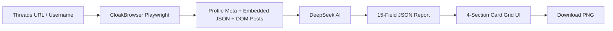

<p align="center">
  
</p>

<h1 align="center">Threads-Roast</h1>

<p align="center">
  <em>AI-powered Threads profile analyzer — savage roasts, sharable reports, screenshot-worthy.</em>
</p>

<p align="center">
  <a href="./README.md">中文版</a>
</p>

---

## Overview

Threads-Roast transforms any Threads username into a 15-dimension AI roast report — plus a **custom formula that calculates your Threads account's monetary value**. Enter a Threads handle → CloakBrowser scrapes their profile & posts → DeepSeek AI generates a hilarious, brutally honest analysis covering roast, strengths, weaknesses, love life, career advice, and more.

## Features

- **Scrape** — fetches profile info and posts (embedded JSON + DOM) via CloakBrowser/Playwright with mobile User-Agent
- **Analyze** — sends formatted data to DeepSeek V4 Flash (free) or V4 Pro, returns structured JSON
- **15 Report Cards** — about, roast, strengths, weaknesses, love life, money, health, colleague perspective, biggest goal, famous comparison, pickup lines, previous life, animal, $50 thing, career, life suggestion
- **Account Value** — proprietary formula calculates your Threads worth in ¥ or $ based on followers and engagement
- **Download as Image** — section-by-section PNG export via html2canvas, plus "Download All"
- **Bilingual UI** — Simplified Chinese / English toggle

## Quick Start

### Try it online

👉 **[threads7.streamlit.app](https://threads7.streamlit.app)**

### Run locally

```bash
# 1. Clone
git clone https://github.com/gokuscraper/threads-roast.git
cd threads-roast

# 2. Install Python deps
pip install -r requirements.txt

# 3. Configure API keys
# Create .streamlit/secrets.toml with:
# OPENCODE_API_KEY = "sk-your-opencode-key-here"

# 4. Run
streamlit run streamlit_app.py
```

### API Keys

| Key | Required | Where to get |
|---|---|---|
| `OPENCODE_API_KEY` | Yes | [OpenCode](https://opencode.ai) free channel |
| `SILICON_API_KEY` | Optional | [SiliconFlow Console](https://cloud.siliconflow.cn) — used as fallback |

## Project Structure

```
threads-roast/
├── streamlit_app.py        # Home page — username/URL input → scrape
├── pages/
│   └── 1_Analysis.py       # 4-section analysis report page
├── lib/
│   ├── ai.py               # AI prompt, dual API strategy
│   ├── tweet_utils.py      # Post formatting & stats
│   └── sidebar.py          # Sidebar navigation
├── scraper/
│   ├── __init__.py         # fetch_all() entry point
│   ├── client.py           # Core scraping (meta, JSON, DOM)
│   ├── config.py           # Mobile UA, viewport, timeout config
│   ├── fetcher.py          # Page fetch helper
│   ├── models.py           # ThreadsUser, ThreadsPost dataclasses
│   ├── parser.py           # Parse raw data → models
│   ├── storage.py          # Local JSON caching
│   ├── subprocess_client.py
│   └── worker.py
├── locales/
│   ├── zh.json             # Chinese UI strings
│   └── en.json             # English UI strings
├── i18n.py                 # i18n helper
└── requirements.txt
```

## How It Works



1. **Input** — Threads username or full profile URL (`https://www.threads.net/@user`)
2. **Scrape** — opens the profile with mobile User-Agent (iPhone Safari) to avoid rate-limiting; extracts data from embedded JSON (`BarcelonaProfileThreadsTabDirectQueryRelayPreloader`) and DOM spans
3. **Merge & Dedup** — JSON posts (with IDs, like counts) merged with DOM-only text posts; substring dedup eliminates duplicates
4. **Analyze** — formatted data sent to DeepSeek with a savage, witty prompt in your chosen language
5. **Report** — 15 cards grouped into 4 downloadable sections
6. **Share** — download section-by-section or all-at-once as PNG

## Tech Stack

| Layer | Technology |
|---|---|
| Frontend | [Streamlit](https://streamlit.io) (single-page app) |
| AI Model | DeepSeek V4 Flash (free) / V4 Pro via [OpenCode](https://opencode.ai) + [SiliconFlow](https://siliconflow.cn) fallback |
| Scraping Engine | [CloakBrowser](https://pypi.org/project/cloakbrowser/) (Playwright) |
| Screenshot | [html2canvas](https://html2canvas.hertzen.com) |
| Deployment | [Streamlit Cloud](https://streamlit.io/cloud) |
| License | Apache 2.0 |

## License

[Apache 2.0](LICENSE)
