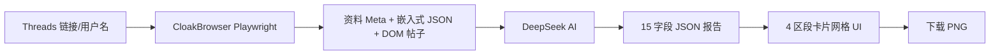

<p align="center">
  
</p>

<h1 align="center">Threads照妖镜</h1>

<p align="center">
  <em>AI 驱动的 Threads 人格分析器 — 毒舌吐槽、一键截图、转发必备</em>
</p>

<p align="center">
  <a href="./README.en.md">English</a>
</p>

---

## 概述

Threads照妖镜只需一个 Threads 用户名或主页链接，就能生成一份包含 15 个维度的 AI 毒舌分析报告——外加一个**独家公式算出你的 Threads 账号值多少钱**。输入 Threads 账号 → CloakBrowser 抓取公开资料和帖子 → DeepSeek AI 生成一份又狠又准的分析，涵盖吐槽、长处、弱点、爱情、金钱、职业建议等。

## 功能

- **抓取** — 通过 CloakBrowser/Playwright 模拟手机浏览器访问，提取嵌入式 JSON 和 DOM 帖子
- **分析** — 格式化数据后发给 DeepSeek V4 Flash（免费）或 V4 Pro，返回结构化 JSON
- **15 张报告卡片** — 简介、吐槽、长处、弱点、爱情、金钱、健康、他人视角、最大目标、相似名人、搭讪语录、前世、代表动物、会买的东西、职业、人生建议
- **账号估值** — 基于粉丝数和互动数据的独家公式，算出你的 Threads 账号值多少钱（¥/$）
- **下载为图片** — 支持按区段逐个下载 PNG，也支持「一键全部下载」
- **中英文切换** — 简体中文 / English 实时切换

## 快速开始

### 在线体验

👉 **[threads7.streamlit.app](https://threads7.streamlit.app)**

### 本地运行

```bash
# 1. 克隆仓库
git clone https://github.com/gokuscraper/threads-roast.git
cd threads-roast

# 2. 安装 Python 依赖
pip install -r requirements.txt

# 3. 配置 API 密钥
# 创建 .streamlit/secrets.toml，内容：
# OPENCODE_API_KEY = "sk-your-opencode-key-here"

# 4. 启动
streamlit run streamlit_app.py
```

### API 密钥

| 密钥 | 必须 | 获取地址 |
|---|---|---|
| `OPENCODE_API_KEY` | 是 | [OpenCode](https://opencode.ai) 免费通道 |
| `SILICON_API_KEY` | 可选 | [SiliconFlow 控制台](https://cloud.siliconflow.cn) — 用作兜底 |

## 项目结构

```
threads-roast/
├── streamlit_app.py        # 首页 — 输入用户名/链接 → 抓取
├── pages/
│   └── 1_Analysis.py       # 4 区段分析报告页
├── lib/
│   ├── ai.py               # AI 提示词，双 API 策略
│   ├── tweet_utils.py      # 帖子格式化 & 统计
│   └── sidebar.py          # 侧边栏导航
├── scraper/
│   ├── __init__.py         # fetch_all() 入口
│   ├── client.py           # 核心采集（meta、JSON、DOM）
│   ├── config.py           # 手机 UA、viewport、超时配置
│   ├── fetcher.py          # 页面请求辅助
│   ├── models.py           # ThreadsUser, ThreadsPost 数据类
│   ├── parser.py           # 解析原始数据 → 模型
│   ├── storage.py          # 本地 JSON 缓存
│   ├── subprocess_client.py
│   └── worker.py
├── locales/
│   ├── zh.json             # 中文界面文案
│   └── en.json             # 英文界面文案
├── i18n.py                 # 国际化辅助
└── requirements.txt
```

## 工作原理



1. **输入** — Threads 用户名或完整主页链接（`https://www.threads.net/@user`）
2. **抓取** — 使用手机 User-Agent（iPhone Safari）模拟手机浏览器访问，绕过 Threads 反爬；从嵌入式 JSON（`BarcelonaProfileThreadsTabDirectQueryRelayPreloader`）和 DOM 提取帖子
3. **合并去重** — JSON 帖子（带 ID 和点赞数）与 DOM 纯文本帖子合并，子串去重消除重复
4. **分析** — 格式化数据发给 DeepSeek，搭配毒舌提示词，使用你选择的语言
5. **报告** — 15 张卡片分为 4 个区段展示
6. **分享** — 按区段逐个下载 PNG，或一键全部下载

## 技术栈

| 层 | 技术 |
|---|---|
| 前端 | [Streamlit](https://streamlit.io)（单页应用） |
| AI 模型 | DeepSeek V4 Flash（免费）/ V4 Pro，通过 [OpenCode](https://opencode.ai) + [SiliconFlow](https://siliconflow.cn) 兜底 |
| 采集引擎 | [CloakBrowser](https://pypi.org/project/cloakbrowser/)（Playwright） |
| 截图 | [html2canvas](https://html2canvas.hertzen.com) |
| 部署 | [Streamlit Cloud](https://streamlit.io/cloud) |
| 协议 | Apache 2.0 |

## 许可证

[Apache 2.0](LICENSE)
